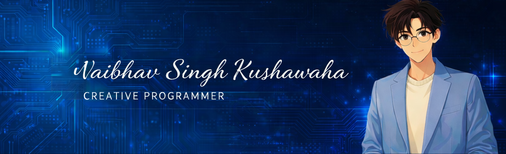
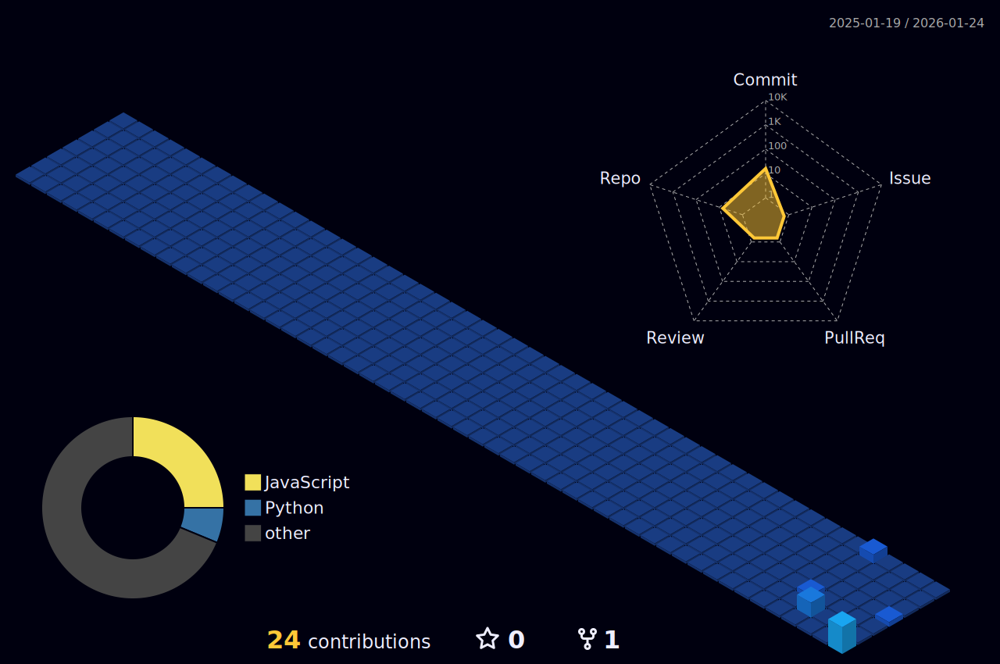
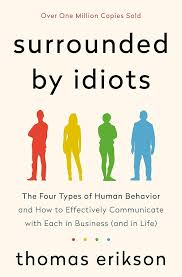
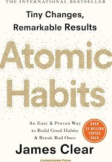
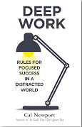
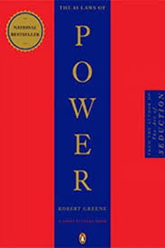

  

<h2 align="center">🛠 Technologies & Tools</h2>

  

<table width="100%" style="border-collapse:collapse;">
<tr>

<td width="72%" align="center" valign="top">

<h3>⭐ Favourite Characters</h3>

<!-- ROW 1 -->

 

<!-- ROW 2 -->

 

<!-- ROW 3 -->

</td>

<td width="28%" align="center" valign="middle">

<h3>🚀 My Portfolio</h3>

Projects • Designs • Work

</td>

</tr>
</table>

<table width="100%" style="border-collapse:collapse;">

<tr>

<td width="30%">

</td>

<td width="34%" align="center">

</td>

<td width="36%" align="center">

<h3>📚 Favourite Books</h3>

 

</td>

</tr>

<tr>

<td width="30%">

</td>

<td colspan="2" align="center">

</td>

</tr>

</table>

<h2 align="center">🤝 Connect With Me</h2>

 

